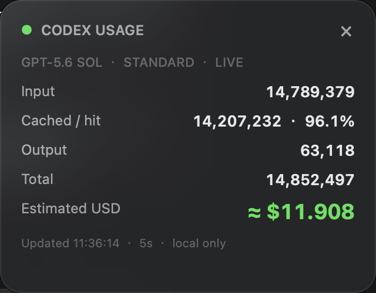

# Codex Token Usage Meter

[English](README.md)

这是一个本地优先的 Codex 插件和 macOS 原生悬浮窗，用于查看 token 使用量、提示词缓存效果、账户限制、Codex credits 以及预估预算消耗（美元）。



## 功能

- 悬浮窗默认每 5 秒刷新一次，可在齿轮菜单中选择 1、5、10、30 或 60 秒。
- 支持英文（默认）和简体中文界面，并记住语言选择。
- token 数字使用 `K`（千）、`W`（万）、`M`（百万）和 `B`（十亿）简写，金额保持完整显示。
- 显示输入、未缓存输入、缓存输入、缓存命中率、输出、推理输出和总 token。
- 按模型和服务层级统计，并识别支持的 Fast 模式倍率。
- 根据内置的 Codex 官方 token 费率快照估算 credits。
- 使用可配置的每 credit 美元价值换算预估 USD。
- 本地 rollout 元数据中包含账户限制时，显示最近的额度状态。
- 完全在本地运行，不需要 API Key，也不会上传对话数据。
- 汇总所有本地活动与归档 Codex 任务，多个窗口并行时不会在不同任务数字之间跳动。
- 排除子代理 rollout 中复制的父任务历史，并忽略重复的累计快照，避免用量被重复统计。
- 悬浮窗关闭期间 Codex 写入的用量，会在重新打开后读取新增记录并补算。
- 小组件使用固定大小的精简快照，并在计数脚本运行时持续读取输出，因此本地历史再多也不会卡在“正在连接 Codex…”。
- 同时提供 macOS 原生置顶悬浮窗、终端看板和 JSON 输出。
- 记住悬浮窗位置，并在所有 macOS 空间中显示。

## 工作原理

Codex 会在 `~/.codex/sessions` 和 `~/.codex/archived_sessions` 中写入本地 JSONL rollout 元数据。计量器读取累计 `token_count` 快照，只累加相邻快照之间的非负变化，因此重复事件不会再次计数。子代理 rollout 可能带有从父任务复制过来的历史前缀；计量器会跟踪这段前缀但不计入用量，直到子任务真正开始后才累计。仅提供单次增量的旧格式日志仍然兼容。全局模式会在 `~/.codex/token-usage-meter/all-index-v2.json` 保存紧凑索引，其中只有用量数字、模型信息和文件偏移，不包含对话正文。首次索引完成后，每次刷新只读取新追加的内容。

缓存输入属于输入 token 的子集，推理 token 属于输出 token 的子集，因此不会重复计费。预估费用的计算方式为：

```text
未缓存输入 × 输入费率
+ 缓存输入 × 缓存输入费率
+ 输出 × 输出费率
```

费率单位为每一百万 token 对应的 credits。内置费率快照链接到 [Codex 官方费率表](https://help.openai.com/en/articles/20001106-codex-rate-card)。USD 默认按每 credit `$0.04` 换算，依据 [Codex credits 条款](https://help.openai.com/en/articles/20001147-codex-credits-for-students-terms-of-service)中 2,500 credits 等于 100 美元的官方示例。

显示的美元金额只是估算值，不是账单。ChatGPT 套餐中已经包含的使用量不一定会产生额外现金费用。

## 运行要求

- 能产生本地 rollout 元数据的 Codex 桌面端或 CLI。
- Python 3.9 或更高版本。
- 原生悬浮窗需要 macOS 13 或更高版本。
- 只有从 Swift 源码重新编译 App 时才需要 Xcode Command Line Tools。

如果存在兼容的 Codex 数据目录，终端和 JSON 报告也可以在其他平台运行。

## 快速使用：独立 macOS App

克隆仓库：

```bash
git clone https://github.com/kafuunochino/codex-token-usage-meter.git
cd codex-token-usage-meter
```

构建唯一的 `~/Applications/Token Usage Widget.app`、启用登录 Mac 后自动启动并立即打开：

```bash
python3 plugins/token-usage-meter/scripts/install_macos.py
```

如果不需要登录自启，可增加 `--no-autostart`。

安装完成后，从“应用程序”或 Spotlight 启动。App 已经内置 token 解析脚本，日常使用不需要再输入终端命令。如果 macOS 因临时签名阻止首次启动，请按住 Control 点击 App，然后选择“打开”。

关闭悬浮窗不会停止 Codex 记录用量。重新打开时会包含关闭期间写入的事件。独立 App 显示整个 Codex 本地安装中所有任务的汇总，而不是某个窗口或任务。如果本地历史很大，首次建立全局索引可能需要一些时间；后续启动会直接复用索引。

点击悬浮窗标题栏右侧的齿轮图标，可以选择界面语言和刷新时间。紧凑的底部信息以“刷新于”开头，并显示完整年月日、星期、时间及当前刷新间隔。

## 安装为 Codex 插件

在克隆后的仓库根目录执行：

```bash
codex plugin marketplace add "$PWD"
codex plugin add token-usage-meter@codex-token-usage-meter
```

新建一个 Codex 任务以加载插件技能，然后输入：

```text
打开实时 token 用量悬浮窗。
```

## 命令行使用

查看当前任务的一次性报告：

```bash
python3 plugins/token-usage-meter/skills/token-usage/scripts/token_usage.py --scope session
```

每 5 秒刷新的终端看板：

```bash
python3 plugins/token-usage-meter/skills/token-usage/scripts/token_usage.py --watch --interval 5 --scope session
```

汇总今天的所有任务：

```bash
python3 plugins/token-usage-meter/skills/token-usage/scripts/token_usage.py --scope today
```

输出 JSON：

```bash
python3 plugins/token-usage-meter/skills/token-usage/scripts/token_usage.py --scope session --json
```

## 重新编译 macOS App

```bash
cd plugins/token-usage-meter
./widget/build_widget.sh
```

构建脚本会把 `token_usage.py` 嵌入 App、应用本地临时签名，并更新同一个 `~/Applications/Token Usage Widget.app`，不会在仓库或插件缓存中留下额外 App 副本。

## 隐私和限制

- 只读取本地 rollout 元数据，不调用 OpenAI API。
- 不保存或传输对话正文。
- `session` 范围只显示一个选定任务；如需汇总可使用 `--scope today` 或 `--scope all`。
- 未知模型仍会显示 token 数量，但费用会显示为不可用，不会猜测价格。
- 费率和产品行为可能变化，依赖估算前请检查文中链接的官方来源。
- Codex 插件不能向桌面端左下角原生界面添加自定义字段，因此使用原生置顶悬浮窗作为替代。

## 测试

```bash
python3 -m unittest discover -s plugins/token-usage-meter/tests -v
```
